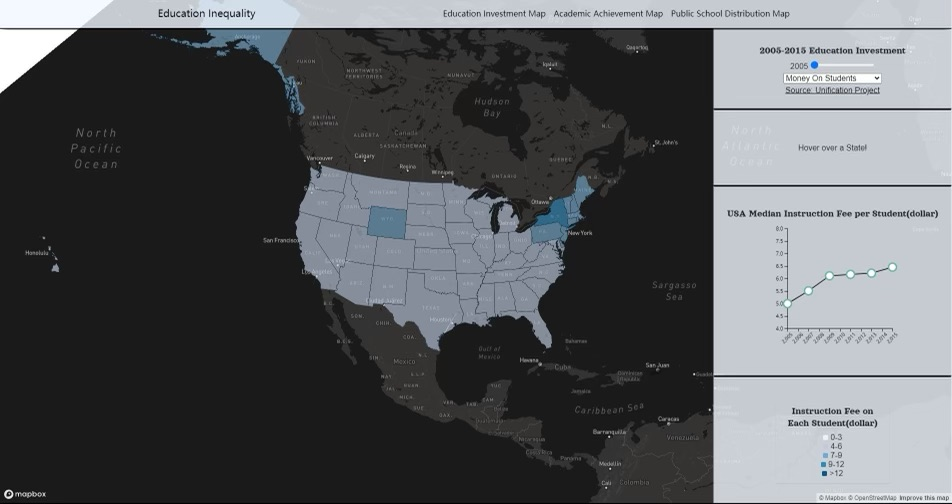
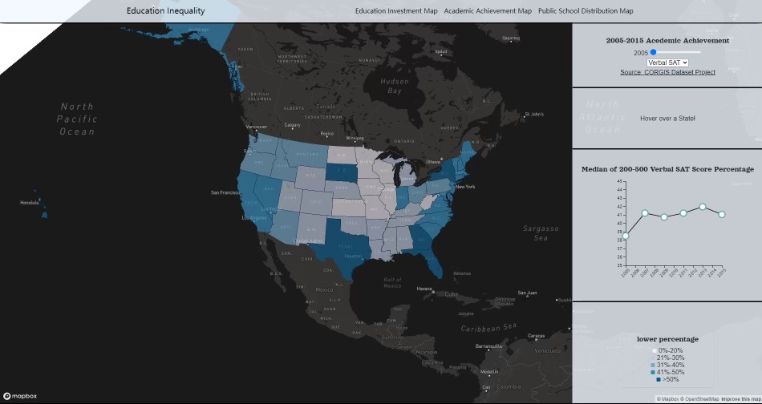

# Group AC2: Disparity of Education Opportunities

## Geography 458 Project Team Members

1. Anush Mughnetsyan
2. Ellen Gorbach
3. Joshua Zhang
4. Julianne Corpuz
5. Megan James Plunkett

[Link to project](https://gorbachellen.github.io/education-inequality/)

## Project Description and Goal

  

Through our final project, we hope to map the disparities between education opportunities within the United States. Inspired by author, Jonathan Kozol’s work Savage Inequalities: Children in America's Schools, we understand that there are differences in fundings for neighborhoods with residents with higher income versus residents with lower income. This contrast led to a huge gap in the quality of education in public schools. The essential resources such as infrastructures, good teachers, or living environments were not equally shared among these public schools when they should have been as they are key factors necessary to equip a child with knowledge and quality assistance. Our team’s goal is to produce a timeline of the average funding each student from each state received from 1993 to 2016 to show how situations were improved or worsened with spatial patterns. Also, we will also show the average reading and mathematical scores of each state along with race and population factors within each period of time.

Demonstrating how living in one location in one’s childhood will impact his or her entire life due to the financial status or the funding from local government to the public school system is the vital factor that highlights the significance of our project. However, our project is not intended to point fingers and create a person or entity to blame. Rather, we want to show the milestones of improvements in each area with our map and give potential advice on the reallocation of public school resources from the federal government.

Map of Education Investments

Map of Academic Achievements

## Target Audience

Our target audiences are parents from each state. Consequently, we have decided to forgo jargon and instead use language that is easy to understand such as the average expenditure on the public school systems for each enrolled student and the childrens’ academic achievement in the exams. The key takeaway we want our audience to have is motivation to speak up for their child because every child in the primary stage of their academic life deserves equal opportunities.

## Primary Sources

1. [U.S. Education Datasets: Unification Project](https://www.kaggle.com/datasets/noriuk/us-education-datasets-unification-project) is a combination of datasets of each state’s total revenue, expenditure, enrolled K-12 students, and students’ academic achievements. The data resources are all from the U.S. Census Bureau and the National Center for Education Statistics (NCES). We plan to make 2 thematic layers on these datasets which we will cover in the project format section of the proposal.  Because we want to show the educational investment in each state as independent variables and academic achievement as the dependent variables, we will allow the users to see details in each layer and compare their places of interest by themselves. There will be separate map layers for years between 1993 and 2016. In addition, we have to connect the dataset to a shapefile in order to make it a map. 

2. Another dataset that our team will use is [NCES School Locations Dataset 2020-2021](https://nces.ed.gov/programs/edge/geographic/schoollocations). This dataset is from the National Center for Education Statistics and it provides the location and name of every public school across all counties between 2020 and 2021. We plan to use the King county portion of the dataset to create a dot density map to make a distinction of where we are all currently residing and where the project was created. The reason why we are only providing a dot density for King County is to ensure that our audience is not being overloaded with information at once and to also preserve and promote intelligibility and prevent our audience from getting distracted with too many points. This dataset intends to show the general patterns of spatial distribution of public schools in King county and it functions as a hook of the project.  

3. The other minor datasets that we will be using include the U.S. Census Population Counts, [King County and its Cities](https://data.kingcounty.gov/Demographics/2010-U-S-Census-Population-Counts-King-County-and-/cavj-x985) and the [Basic demographics by census tracts in King County based on 2012 - 2016 American Community Survey 5 Year Average](https://gis-kingcounty.opendata.arcgis.com/datasets/kingcounty::demographic-base-demographic-base-area/explore?location=47.425253%2C-121.802498%2C10.00&showTable=true) to optimize the other datasets mentioned above. Additionally, we will also use the [Cartographic Boundary Files - Shapefile](https://www.census.gov/geographies/mapping-files/time-series/geo/carto-boundary-file.html) for our shapefiles.  

## Applied Libraries and Web Services
* [Mapbox](https://www.mapbox.com/) for map creation
* [GitHub](https://github.com/) for hosting the project repository
* [Start Bootstrap](https://startbootstrap.com/) for website templates
* [D3 js](https://d3js.org/) for chart visualization

## Multimedia
* [Education Statistics: Facts About American Schools](https://www.edweek.org/leadership/education-statistics-facts-about-american-schools/2019/01)
* [Jonathan Kozol - Savage Inequalities](https://www.youtube.com/watch?v=f6wCsAXmjdI)

## Defining Terms

### **Map of Education and Investment**
> **“Money on Students”:** Spending on student instruction fees (per student), measured in dollars

> **“Enrollment”:** Total number of students enrolled in public school (in thousands of students) 

> **“Instruction Expenditure”:** Total expenditure (in millions of dollars) for all students spent on instruction fees

> **“Federal Revenue”:** Total amount allocated to public schools, measures in thousands of dollars

### **Map of Academic Achievement**
> **“Verbal SAT”:** Percentage of students who received a 200-500 on the Critical Reading portion of the SAT. The range 200-500 was selected, as scores in a lower range are less likely to be impacted by private tutoring and other resources.

> **“Math SAT”:** Percentage of students who received a 200-500 on the Math portion of the SAT. The range 200-500 was selected, as scores in a lower range are less likely to be impacted by private tutoring and other resources.

> **“Art GPA”:** Average GPAs, consisting of Arts/Music GPA, English GPA, Foreign Languages GPA, and Social Sciences GPA

> **“STEM GPA”:** Average GPAs, consisting of Mathematics GPA and Natural Sciences GPA

## Recognition of Potential Biases
We recognize the inherent biases of SAT scores as a reflection of education level. Students of a lower family income level tend to score lowest, whereas students of a higher family income level have much higher average scores. Disadvantage can mostly be attributed to test preparation, but may also have something to do with “stereotype threat”, where “reminding students of their racial group before taking a test can impact their score” (Elsesser, 2019). Additionally, at this point in time, points were deducted for incorrect answers. With this in mind, students took different approaches than others when it came to the exam that could affect performance. Therefore, while our data is sound, SAT scores themselves are not always reflective of a population and how they otherwise perform academically.

[Source: Forbes article](https://www.forbes.com/sites/kimelsesser/2019/12/11/lawsuit-claims-sat-and-act-are-biased-heres-what-research-says/?sh=704a15bf3c42)

## Acknowledgement

This github repository is a work based on guidelines from Geog 458 Advanced Digital Geographies created by Professor Bo Zhao from University of Washington.
